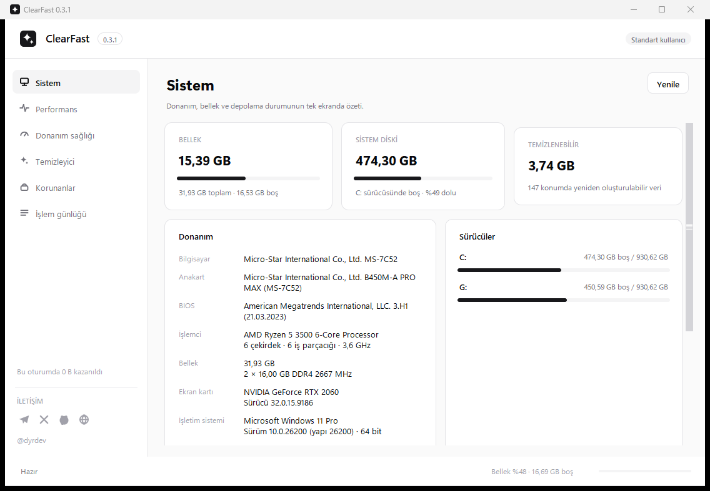
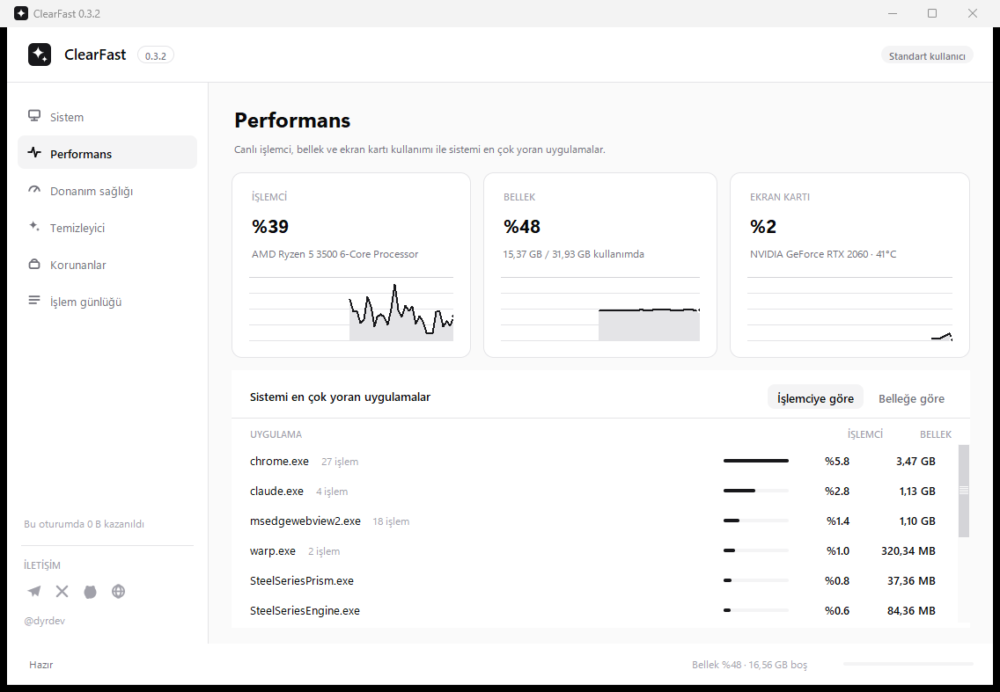
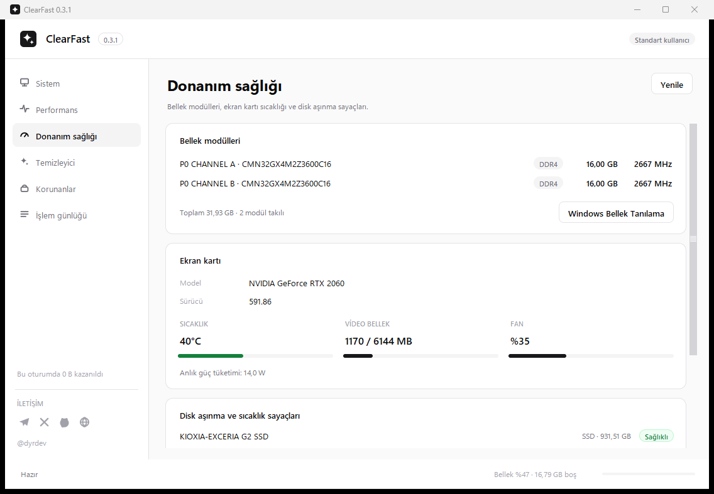
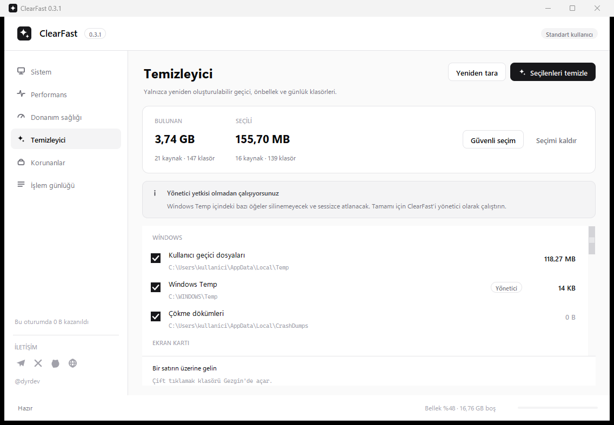
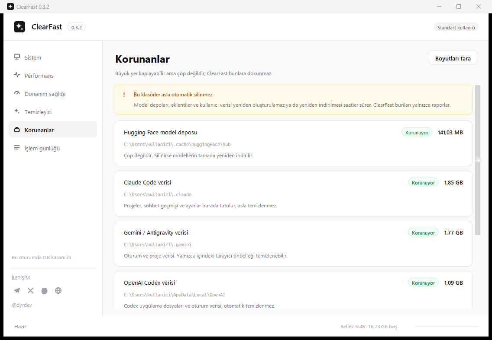
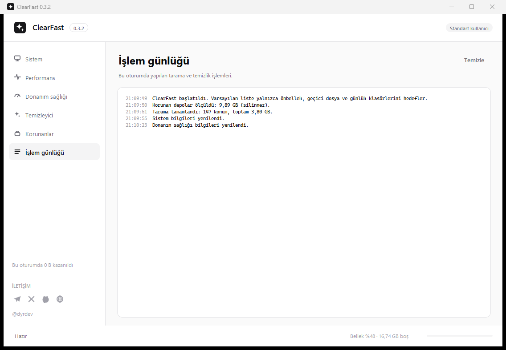

<div align="center">

# ClearFast

**Open-source Windows cleanup, performance monitoring and hardware health utility**

Windows 10/11 için geçici dosya ve önbellek temizliği, canlı sistem performansı, donanım bilgileri ve disk sağlığı araçlarını tek arayüzde birleştiren açık kaynak masaüstü uygulaması.


[İndir / Download](https://github.com/bendiyardev/ClearFast/releases/latest) · [Değişiklikler / Changelog](CHANGELOG.md) · [Güvenlik ve doğrulama](docs/ANTIVIRUS.md)

</div>

---

## ClearFast nedir?

ClearFast; Windows üzerinde biriken yeniden oluşturulabilir geçici dosyaları, uygulama önbelleklerini ve günlük dosyalarını tarayan, boyutlarını gösteren ve yalnızca kullanıcı onayıyla temizleyen açık kaynak bir sistem aracıdır.

Temizleme özelliklerine ek olarak aynı uygulama içinde canlı CPU, RAM ve GPU takibi, süreç analizi, sistem bilgileri, bellek modülleri ve disk sağlık göstergeleri sunar.

## Öne çıkan özellikler

- **Windows temizleyici:** geçici dosyalar, tarayıcı önbellekleri, geliştirici araçları ve yapay zekâ uygulamalarının yeniden oluşturulabilir önbellekleri.
- **Canlı performans izleme:** CPU, bellek ve GPU kullanım grafikleri ile kaynak tüketen uygulamaların görünümü.
- **Donanım sağlığı:** RAM modülleri, GPU ölçümleri, disk sıcaklığı ve aşınma sayaçları.
- **Sistem bilgileri:** anakart, BIOS, işlemci, bellek, ekran kartı ve Windows yapı bilgileri.
- **Korumalı hedefler:** model depoları, sohbet geçmişleri, tarayıcı profilleri ve kullanıcı verileri temizleme hedefi olarak kullanılmaz.
- **Onaylı temizlik:** kullanıcı onayı olmadan dosya silinmez.
- **Yönetici zorunluluğu yok:** uygulama ve kurulum standart kullanıcı hesabıyla çalışacak şekilde tasarlanmıştır.
- **Harici Python paketi yok:** Python standart kütüphanesi ve Tk tabanlıdır.
- **Açık kaynak:** kaynak kod MIT lisansı altında incelenebilir, değiştirilebilir ve yeniden dağıtılabilir.

## Ekran görüntüleri

### Sistem



### Performans



### Donanım sağlığı



### Temizleyici



### Korunanlar



### İşlem günlüğü



## Desteklenen temizlik kaynakları

ClearFast; Windows, Chromium tabanlı tarayıcılar, Firefox, VS Code ve çeşitli geliştirici / yapay zekâ araçlarının yeniden üretilebilir önbelleklerini algılayabilir.

Örnek kaynaklar:

- Windows Temp, CrashDumps ve DirectX önbellekleri
- Chrome, Edge, Brave ve Firefox
- VS Code
- Claude Desktop ve Claude Code
- OpenAI Codex
- Cursor, Trae, Windsurf ve benzeri geliştirici araçları
- LM Studio ve Ollama günlük / önbellekleri
- PyTorch, Triton ve NVIDIA CUDA JIT önbellekleri
- pip, npm, uv, pnpm ve Yarn gibi opsiyonel paket önbellekleri

Model dosyaları, proje dosyaları, kullanıcı profilleri ve sohbet geçmişleri koruma kapsamındadır.

## İndir ve çalıştır

En güncel paket:

**[ClearFast for Windows — Latest Release](https://github.com/bendiyardev/ClearFast/releases/latest)**

ZIP arşivini tamamen çıkardıktan sonra:

```text
ClearFast.exe              Uygulamayı doğrudan çalıştırır
Kurulum.bat                Bilgisayara kurulum başlatır
ClearFast.exe --uninstall  Kaldırma akışını başlatır
```

Dağıtım tek klasör yapısını kullanır. Bu yaklaşım çalışma zamanı dosyalarını görünür ve doğrulanabilir bir dizin yapısında tutar.

## Güvenlik ve doğrulama

ClearFast kaynak kodu tamamen bu depoda tutulur. Yayınlanan paketi bağımsız olarak doğrulamak için sürüm dosyalarıyla birlikte sunulan SHA-256 özetlerini kullanabilirsiniz.

```powershell
Get-FileHash .\ClearFast-0.3.2-Windows.zip -Algorithm SHA256
```

Uygulama şu tasarım ilkelerini izler:

- yalnızca açıkça tanımlanmış yeniden oluşturulabilir hedefleri tarar,
- temizlikten önce hedef ve boyut bilgisini gösterir,
- kullanıcı onayı olmadan temizlik başlatmaz,
- uygulama köklerini ve kullanıcı verisi olarak sınıflandırılan alanları korur,
- telemetri toplamaz,
- arka planda güncelleme sorgusu yapmaz,
- kullanıcı etkileşimi olmadan harici servislere veri göndermez.

Daha ayrıntılı doğrulama ve kod imzalama notları için [güvenlik ve doğrulama dokümanına](docs/ANTIVIRUS.md) bakın.

## Kaynaktan çalıştırma

Gereksinimler:

- Windows 10 veya Windows 11
- Python 3.10+

```bat
git clone https://github.com/bendiyardev/ClearFast.git
cd ClearFast
py -3 ClearFast.py
```

## Derleme

```bat
Build.bat
```

Manuel PyInstaller akışı:

```bat
py -3 -m PyInstaller --noconfirm --clean ClearFast.spec
```

## Test

Bütünlük ve temel davranış testleri:

```bat
py -3 tools\selftest.py
```

Arayüz kontrolü:

```bat
py -3 tools\_smoke.py 8
```

## Proje yapısı

```text
ClearFast/
├── ClearFast.py
├── ClearFastSetup.py
├── cf_core.py
├── cf_metrics.py
├── cf_ui.py
├── cf_raster.py
├── cf_win.py
├── tools/
├── docs/
├── release/
├── Build.bat
└── ClearFast.spec
```

## Teknoloji

- Python
- Tk / Tkinter
- Win32 API
- ctypes
- PyInstaller

ClearFast mümkün olduğunca az bağımlılıkla, okunabilir ve denetlenebilir bir Windows masaüstü aracı olarak geliştirilmektedir.

## Katkı

Issue ve pull request katkıları açıktır. Yeni temizlik hedefleri eklenirken kullanıcı verisini koruyan mevcut güvenlik sınırlarının korunması gerekir.

## Lisans

Bu proje [MIT License](LICENSE) ile lisanslanmıştır.

---

## English

ClearFast is an open-source Windows cleanup, performance monitoring and hardware health utility for Windows 10 and Windows 11.

It scans reproducible temporary files and application caches, shows their size, and removes them only after explicit user confirmation. The same application also provides live CPU, memory and GPU monitoring, process insights, system specifications and hardware-health information.

### Core features

- Windows temporary-file and cache cleanup
- Browser and developer-tool cache detection
- AI/developer application cache cleanup
- Live CPU, memory and GPU monitoring
- Hardware and system information
- Protected user-data locations
- Explicit cleanup confirmation
- No external Python package dependency
- Open-source MIT license

### Build from source

```bat
git clone https://github.com/bendiyardev/ClearFast.git
cd ClearFast
Build.bat
py -3 tools\selftest.py
```

For the latest Windows package, see [GitHub Releases](https://github.com/bendiyardev/ClearFast/releases/latest).
