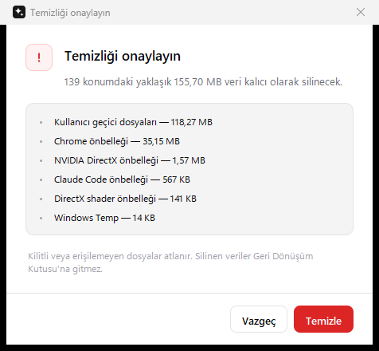
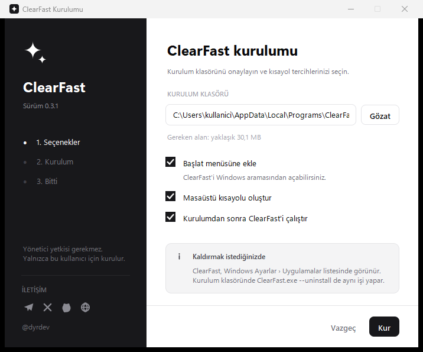
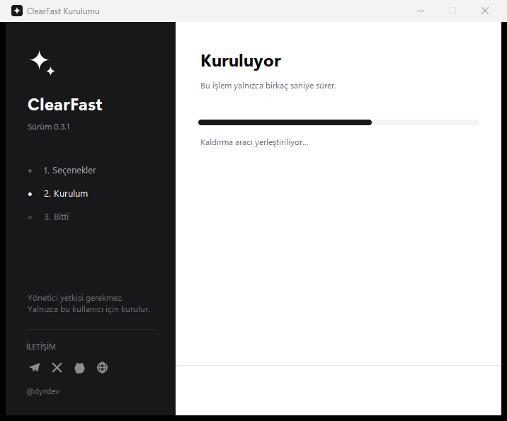
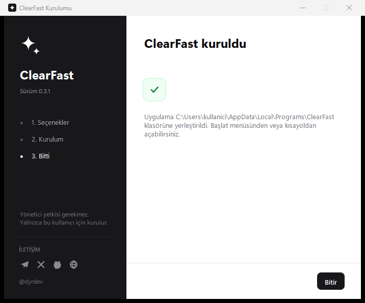

<div align="center">

```
 ██████╗██╗     ███████╗ █████╗ ██████╗ ███████╗ █████╗ ███████╗████████╗
██╔════╝██║     ██╔════╝██╔══██╗██╔══██╗██╔════╝██╔══██╗██╔════╝╚══██╔══╝
██║     ██║     █████╗  ███████║██████╔╝█████╗  ███████║███████╗   ██║
██║     ██║     ██╔══╝  ██╔══██║██╔══██╗██╔══╝  ██╔══██║╚════██║   ██║
╚██████╗███████╗███████╗██║  ██║██║  ██║██║     ██║  ██║███████║   ██║
 ╚═════╝╚══════╝╚══════╝╚═╝  ╚═╝╚═╝  ╚═╝╚═╝     ╚═╝  ╚═╝╚══════╝   ╚═╝
```

**Windows için açık kaynak temizlik, performans ve donanım sağlığı aracı**

*Open-source cleanup, performance and hardware-health tool for Windows*


[**Türkçe**](#-türkçe) · [**English**](#-english) · [**İndir / Download**](#-i̇ndir--download)

</div>

---

## 📸 Ekran görüntüleri / Screenshots

<div align="center">

### Sistem · System
Tam donanım künyesi, bellek ve disk doluluğu, fiziksel disk sağlığı.
*Full hardware specification, memory and disk usage, physical disk health.*


### Performans · Performance
Saniyede yenilenen grafikler ve sistemi en çok yoran uygulamalar.
*Per-second charts and the applications consuming the most resources.*


### Donanım sağlığı · Hardware health
Bellek modülleri, ekran kartı sıcaklığı, disk aşınma sayaçları.
*Memory modules, GPU temperature, disk wear counters.*


### Temizleyici · Cleaner
Kategorilere ayrılmış kaynaklar, bağlama duyarlı uyarılar.
*Sources grouped by category, context-aware warnings.*


### Korunanlar · Protected
Büyük ama silinmemesi gereken model ve veri klasörleri.
*Large folders that must never be deleted — reported only.*


### İşlem günlüğü · Activity log
Oturumdaki her tarama ve temizlik, zaman damgasıyla.
*Every scan and cleanup in the session, timestamped.*


### Silme onayı · Delete confirmation
Hiçbir şey sorulmadan silinmez.
*Nothing is ever deleted without confirmation.*



### Kurulum programı · Installer

<table>
<tr>
<td width="33%"></td>
<td width="33%"></td>
<td width="33%"></td>
</tr>
<tr>
<td align="center"><b>1. Seçenekler</b><br><i>Options</i></td>
<td align="center"><b>2. Kurulum</b><br><i>Installing</i></td>
<td align="center"><b>3. Bitti</b><br><i>Done</i></td>
</tr>
</table>

</div>

---

## 📦 İndir / Download

**[⬇ ClearFast-0.3.1-Windows.zip](https://github.com/bendiyardev/ClearFast/releases/latest)**
· [Tüm sürümler / All releases](https://github.com/bendiyardev/ClearFast/releases)
· [`SHA256SUMS.txt`](release/SHA256SUMS.txt)

ZIP'i **tamamen** çıkarın, sonra:

| | Türkçe | English |
|---|---|---|
| Kurmadan çalıştır | `ClearFast.exe` | Run without installing |
| Bu bilgisayara kur | `Kurulum.bat` | Install on this machine |
| Kaldır | `ClearFast.exe --uninstall` | Uninstall |

> **TR** — Tek dosyalık EXE yerine **tek klasör** dağıtılır. Bunun nedeni
> `--onefile` paketlemenin çalışırken kendini `%TEMP%` altına açması ve bu
> davranışın virüs tarayıcılarda yanlış pozitife yol açmasıdır. Ayrıntı:
> [docs/ANTIVIRUS.md](docs/ANTIVIRUS.md).
> Dosyalar kod imzalama sertifikasıyla imzalı değildir; SmartScreen
> "Bilinmeyen yayımcı" uyarısı gösterebilir. Güvenmek yerine
> **doğrulayabilirsiniz**: kaynak kodun tamamı burada, `Build.bat` ile aynı
> çıktıyı kendi bilgisayarınızda üretebilirsiniz.
>
> **EN** — Distributed as **one folder**, not a single EXE: `--onefile`
> packaging unpacks itself into `%TEMP%` at runtime, which causes antivirus
> false positives. Details in [docs/ANTIVIRUS.md](docs/ANTIVIRUS.md).
> The binaries are not code-signed, so SmartScreen may warn about an unknown
> publisher. Rather than trusting them you can **verify**: the full source is
> here and `Build.bat` reproduces the same output on your machine.

---

# 🇹🇷 Türkçe

## Nedir?

ClearFast, Windows'ta biriken **yeniden oluşturulabilir** geçici dosyaları,
önbellekleri ve günlükleri bulan, boyutlarını gösteren ve **yalnızca sizin
onayınızla** silen bir araçtır. Aynı pencerede sistem künyesini, canlı
performans grafiklerini ve donanım sağlığını da gösterir.

Tek bir tasarım ilkesi vardır: **kullanıcıyı hiçbir zaman şaşırtma.**
Ne silineceği, nerede olduğu ve silinirse ne olacağı silmeden önce yazılıdır.

## Öne çıkanlar

| | |
|---|---|
| 🧹 **28 temizlik kaynağı** | Windows, ekran kartı, tarayıcı, yapay zekâ araçları, paket yöneticileri |
| 🤖 **Yapay zekâya özel** | Claude, Codex, Cursor, Trae, Antigravity, Windsurf, LM Studio, Copilot, Ollama |
| 📊 **Canlı performans** | İşlemci / bellek / GPU grafikleri, süreç sıralaması |
| 🩺 **Donanım sağlığı** | RAM modülleri, GPU sıcaklığı, SSD aşınma sayaçları |
| 🔒 **Koruma listesi** | Model depoları ve sohbet geçmişi asla hedeflenmez |
| 📦 **Sıfır bağımlılık** | Yalnızca Python standart kütüphanesi + Tk |
| 🎨 **Modern arayüz** | Kenarı yumuşatılmış çizim, DPI farkındalığı, tutarlı tipografi |
| 🪪 **Yönetici gerekmez** | Kurulum da uygulama da standart kullanıcıyla çalışır |

## Güvenlik yaklaşımı

ClearFast bir uygulamanın **kök klasörünü asla hedeflemez.** Yalnızca adı
bilinen ve yeniden oluşturulabilir olduğu kesin olan klasörleri eşler.

```
                       ┌──────────────────────────────┐
        Tarama  ──────▶│   28 temizlik hedefi         │
                       └───────────────┬──────────────┘
                                       │
                 ┌─────────────────────┴─────────────────────┐
                 │                                           │
     ┌───────────▼────────────┐               ┌──────────────▼─────────────┐
     │  SABİT YOL             │               │  AD EŞLEŞMELİ TARAMA       │
     │  %TEMP%                │               │  Cache, Code Cache,        │
     │  %WINDIR%\Temp         │               │  GPUCache, ShaderCache,    │
     │  CrashDumps, D3DSCache │               │  logs, Crashpad, ...       │
     └───────────┬────────────┘               └──────────────┬─────────────┘
                 └─────────────────────┬─────────────────────┘
                                       │
                          ┌────────────▼────────────┐
                          │  Var mı?  Boyutu ne?    │
                          └────────────┬────────────┘
                                       │
                          ┌────────────▼────────────┐
                          │  KULLANICI ONAYI        │  ◀── zorunlu adım
                          │  liste + boyut + uyarı  │
                          └────────────┬────────────┘
                                       │
                          ┌────────────▼────────────┐
                          │  Klasörün İÇERİĞİ silinir│
                          │  klasörün KENDİSİ kalır  │
                          │  kilitli dosyalar atlanır│
                          └─────────────────────────┘
```

Kodda bunu güvence altına alan üç karar:

1. **`env_path()`** — bir ortam değişkeni eksikse çalışma klasörüne düşmek
   yerine kasıtlı olarak geçersiz bir yol döndürür. Böylece `%TEMP%` tanımsızsa
   yanlışlıkla başka bir klasör silinemez.
2. **`chromium_caches()`** — uygulama klasörünün altında yalnızca güvenli
   listedeki adları eşler, eşleşen klasörün içine inmez, paket yöneticisi
   klasörlerini (`pip`, `npm`, `uv` …) atlar.
3. **`delete_contents()`** — hedef klasörün kendisini değil içeriğini siler;
   `OSError` yakalanır, kilitli dosya işlemi durdurmaz.

## Neler temizlenir, neler asla silinmez

```
  ✔ TEMİZLENİR (yeniden oluşturulur)     ✘ ASLA SİLİNMEZ (yalnızca raporlanır)
  ──────────────────────────────────     ────────────────────────────────────
  %TEMP% ve Windows\Temp                 Hugging Face model deposu
  Çökme dökümleri (CrashDumps)           Ollama modelleri
  DirectX shader önbelleği               LM Studio modelleri
  NVIDIA DX / OpenGL / CUDA JIT          PyTorch model önbelleği
  Chrome · Edge · Brave · Firefox        .claude  (projeler, sohbet geçmişi)
  VS Code önbellek + günlükleri          .gemini  (oturum ve proje verisi)
  Claude Desktop · Claude Code           OpenAI Codex verisi
  OpenAI Codex · Cursor · Trae           VS Code eklentileri
  Antigravity · Windsurf · LM Studio     Cursor kullanıcı verisi
  Copilot · Cline · Warp · Ollama log    Tarayıcı profilleri, şifreler, yer imleri
  PyTorch / Triton derleme önbelleği     Belgeler · Masaüstü · İndirilenler
                                         Proje klasörleriniz
  ○ OPSİYONEL (varsayılan kapalı)
  ──────────────────────────────────
  pip · npm · uv · pnpm · Yarn
  Eklenti indirme önbellekleri
```

**Opsiyonel** olanlar veri kaybettirmez; yalnızca ilgili paketler bir sonraki
kurulumda yeniden indirilir. Seçtiğinizde arayüzde sarı bir uyarı belirir.

## Sayfalar

```
┌─────────────────────────────────────────────────────────────────────────┐
│  ✦  ClearFast  0.3.0                               Standart kullanıcı   │
├────────────────────┬────────────────────────────────────────────────────┤
│  ▣  Sistem         │                                                    │
│  ∿  Performans     │                                                    │
│  ◔  Donanım sağlığı│                                                    │
│  ✦  Temizleyici    │                  SAYFA İÇERİĞİ                     │
│  ⌂  Korunanlar     │                                                    │
│  ≡  İşlem günlüğü  │                                                    │
│                    │                                                    │
│  ────────────────  │                                                    │
│  Bu oturumda …     │                                                    │
│  ────────────────  │                                                    │
│  İLETİŞİM          │                                                    │
│  ✈  ✕  ◉  ⊕        │                                                    │
│  @dyrdev           │                                                    │
├────────────────────┴────────────────────────────────────────────────────┤
│  Hazır                                     Bellek %42 · 18,4 GB boş     │
└─────────────────────────────────────────────────────────────────────────┘
```

| Sayfa | İçerik |
|---|---|
| **Sistem** | Bilgisayar, anakart, BIOS, işlemci (çekirdek / iş parçacığı / frekans), bellek modülü özeti, ekran kartı ve sürücüsü, Windows yapısı, açık kalma süresi, sürücü doluluk çubukları, fiziksel disk sağlığı |
| **Performans** | Saniyede yenilenen işlemci / bellek / ekran kartı grafikleri; süreçleri ada göre gruplayan, işlemci veya belleğe göre sıralanabilen "en çok yoran uygulamalar" listesi |
| **Donanım sağlığı** | Bellek modülleri (yuva, kapasite, tip, hız, model), ekran kartı sıcaklık / video bellek / fan / güç ölçümleri, disk aşınma-sıcaklık-hata sayaçları, Windows Bellek Tanılama kısayolu |
| **Temizleyici** | Kategorilere ayrılmış kaynaklar, kaynak bazında seçim, bağlama duyarlı uyarılar, ayrıntılı silme onayı |
| **Korunanlar** | Büyük ama silinmemesi gereken model ve veri klasörleri; yalnızca boyut raporlanır |
| **İşlem günlüğü** | Oturumdaki tüm tarama ve temizlik işlemleri, zaman damgalı |

### Ölçümler nereden geliyor?

| Veri | Kaynak |
|---|---|
| İşlemci kullanımı | `GetSystemTimes` (kernel32) — süreç başlatmadan, doğrudan Win32 API |
| Süreç listesi | `EnumProcesses` + `GetProcessTimes` + `GetProcessMemoryInfo` (psapi) |
| Bellek | `GlobalMemoryStatusEx` (kernel32) |
| Ekran kartı | `nvidia-smi` (varsa) — kullanım, VRAM, sıcaklık, fan, güç |
| Bellek modülleri | `Win32_PhysicalMemory` (CIM) |
| Disk sağlığı | `Get-PhysicalDisk` + `Get-StorageReliabilityCounter` (CIM) |
| Künye | `Win32_OperatingSystem`, `Win32_BaseBoard`, `Win32_BIOS`, `Win32_Processor` |

> Disk aşınma sayaçları **yönetici yetkisi** gerektirir. Yetki yoksa uygulama
> bunu bir uyarı kutusuyla açıkça belirtir, sessizce boş göstermez.

## Kurulum

ZIP arşivini **klasörüyle birlikte** çıkarın. `ClearFast.exe` yanındaki
`_internal` klasörü olmadan çalışmaz.

### 1. Kurarak (önerilen)

`Kurulum.bat` dosyasına çift tıklayın — aynısı: `ClearFast.exe --setup`

- Yönetici yetkisi **istemez**
- `%LOCALAPPDATA%\Programs\ClearFast` klasörüne kurar
- Başlat menüsü ve (isteğe bağlı) masaüstü kısayolu oluşturur
- Windows **Ayarlar › Uygulamalar** listesine kaydeder

**Kaldırma:** Ayarlar › Uygulamalar › ClearFast › Kaldır
veya kurulum klasöründe `ClearFast.exe --uninstall`

### 2. Taşınabilir

Doğrudan `ClearFast.exe` dosyasını çalıştırın. Hiçbir şey kurmaz, kayıt
defterine yazmaz, USB bellekten de çalışır.

### 3. Kaynaktan

Python 3.10+ kuruluysa `ClearFast.bat` dosyasına çift tıklayın.
Uygulamanın çalışması için **hiçbir harici paket gerekmez.**

> Kurulum ve kaldırma ayrı bir program değildir; aynı EXE'nin kipleridir.
> Bu, içinde başka bir EXE taşıyan bir kurucu olmadığı anlamına gelir.

## Kaynaktan derleme

```bat
:: Tek klasörlü sürüm  ->  dist\ClearFast\
Build.bat
```

Betik PyInstaller'ı eksikse kendisi kurar. Elle yapmak isterseniz:

```bat
py -3 -m pip install --upgrade pyinstaller
py -3 tools\make_icon.py                              :: assets\ClearFast.ico
py -3 -m PyInstaller --noconfirm --clean ClearFast.spec
```

Yardımcı araçlar:

```bat
py -3 tools\_smoke.py 8            :: arayüzü açar, hata var mı diye bakar
py -3 tools\make_screenshots.py    :: docs\img görüntülerini yeniler
py -3 tools\make_release.py        :: masaüstüne dağıtım ZIP'i hazırlar
```

## Proje yapısı

```
ClearFast/
│
├── ClearFast.py              ▸ Uygulama penceresi, sayfalar, canlı ölçüm döngüsü
├── cf_core.py                ▸ Temizlik hedefleri, tarama, silme, sistem bilgisi
├── cf_metrics.py             ▸ İşlemci / süreç / GPU / RAM / disk ölçümleri
├── cf_ui.py                  ▸ Tasarım sistemi: renk tokenleri ve bileşenler
├── cf_raster.py              ▸ Kenar yumuşatmalı PNG ve ICO üretimi (saf stdlib)
├── ClearFastSetup.py         ▸ Kurulum ve kaldırma programı
│
├── ClearFast.bat             ▸ Kaynaktan çalıştırıcı
├── Kurulum.bat               ▸ ClearFast.exe --setup kısayolu
├── Build.bat                 ▸ Tek klasörlü sürümü derler
├── ClearFast.spec            ▸ PyInstaller yapılandırması (onedir, UPX kapalı)
│
├── assets/
│   ├── ClearFast.ico         ▸ 8 boyutlu simge (tools/make_icon.py üretir)
│   └── ClearFast-256.png
│
├── installer/
│   └── version_app.txt       ▸ EXE sürüm kaynağı (VERSIONINFO)
│
├── release/                  ▸ Dağıtım ZIP'i + SHA256SUMS.txt
├── docs/
│   ├── ANTIVIRUS.md          ▸ Yanlış pozitifler ve doğrulama
│   └── img/                  ▸ README ekran görüntüleri
│
└── tools/
    ├── make_icon.py          ▸ Uygulama simgesini üretir
    ├── make_release.py       ▸ Dağıtım ZIP'i hazırlar
    ├── make_screenshots.py   ▸ Belgeleme görüntülerini üretir
    ├── _smoke.py             ▸ Arayüzü açıp hata denetimi yapar
    └── _shot.py              ▸ Pencere yakalama yardımcısı
```

## Mimari notlar

**Neden harici paket yok?** Tek dosyalık EXE'nin küçük kalması ve kaynak koddan
çalıştırmanın `pip install` gerektirmemesi için her şey standart kütüphaneyle
yazıldı. Pillow yerine `cf_raster.py`, `psutil` yerine `ctypes` ile Win32 API.

**Kenar yumuşatma.** Tk'nin Canvas'ı kenar yumuşatma yapmaz. `cf_raster.py`,
işaretli mesafe fonksiyonlarıyla (SDF) küçük PNG parçaları üretip `zlib` ile
sıkıştırır ve `tk.PhotoImage`'a base64 olarak verir. Yuvarlak köşeler,
ikonlar, rozetler ve uygulama simgesi bu yoldan gelir.

**Ölçekleme.** Uygulama per-monitor DPI farkındalığı açar; tüm geometri
`ui.px()` üzerinden geçtiği için %125 ve %150 ölçeklemede de keskin kalır.

**İş parçacıkları.** Tarama, silme ve ölçüm arka planda çalışır; sonuçlar bir
`queue.Queue` üzerinden ana iş parçacığına aktarılır. Tk nesnelerine yalnızca
ana iş parçacığı dokunur.

**Paketleme.** Tek dosya değil tek klasör, ve UPX kapalı — ikisi de bilinçli:
virüs tarayıcıların paketlenmiş zararlıyla ilişkilendirdiği kalıplardan
kaçınmak için. Kurulum ve kaldırma aynı EXE'nin kipleri olduğu için hiçbir
ikili başka bir ikilinin içine gömülmez. Bkz. [docs/ANTIVIRUS.md](docs/ANTIVIRUS.md).

## Sık sorulanlar

**Silinen dosyalar Geri Dönüşüm Kutusu'na gider mi?**
Hayır. Silme kalıcıdır; bu nedenle onay penceresinde açıkça yazar.

**Temizlikten sonra uygulamalarım yavaşlar mı?**
Önbelleği silinen uygulamanın yalnızca **ilk** açılışı biraz yavaşlar, sonra
önbellek kendini yeniden oluşturur.

**Sohbet geçmişim veya modellerim silinir mi?**
Hayır. Bunlar "Korunanlar" sayfasında listelenir ve hiçbir zaman
hedeflenmez — kod düzeyinde ayrı bir listede tutulurlar.

**Yönetici olarak çalıştırmalı mıyım?**
Gerekli değil. Yalnızca Windows Temp'in tamamı ve disk aşınma sayaçları için
gerekir; ikisini de uygulama size önceden bildirir.

**Antivirüs uyarı verdi.**
0.3.1'de bunun iki ana nedeni (kendini açan tek dosya paketleme ve gömülü EXE
taşıyan kurulum) kaldırıldı. İmzasız dosyalar yine de sezgisel taramaya
takılabilir. Ne yapılacağı, nasıl doğrulanacağı ve yanlış pozitifin nasıl
bildirileceği: [docs/ANTIVIRUS.md](docs/ANTIVIRUS.md)

## Katkı

Sorun bildirimi ve öneriler için **Issues**, değişiklikler için **Pull Request**
açabilirsiniz. Kod tarzı: standart kütüphane dışına çıkmadan, satır uzunluğu
100 karakter, Türkçe kullanıcı metni + İngilizce/Türkçe teknik yorum.

Yeni bir temizlik hedefi eklerken lütfen şunlara dikkat edin:

- Hedef **yeniden oluşturulabilir** olmalı (silinince veri kaybı olmamalı).
- Kullanıcı verisi ihtimali varsa `default_selected=False` ve `risk="Opsiyonel"`.
- Açıklama alanı, silinirse ne olacağını **açıkça** yazmalı.
- Uygulama kök klasörü hedeflenmemeli; ad eşleşmeli tarama tercih edilmeli.

## Teşekkürler

Bu proje şu araçların ve fikirlerin üzerine kuruldu:

- **Python** ve **Tk/Tcl** — arayüzün tamamı standart kütüphaneyle yazıldı
- **PyInstaller** — tek dosyalık dağıtım
- **shadcn/ui** — renk, boşluk ve tipografi ölçeği yaklaşımı ilham kaynağı oldu
- **Lucide** — ikonların ince konturlu çizim dili
- **Inigo Quilez**'in işaretli mesafe fonksiyonu (SDF) yazıları — `cf_raster.py`
  kenar yumuşatmasının temeli
- **NVIDIA** `nvidia-smi` — ekran kartı ölçümleri

Ve deneyip geri bildirim veren herkese teşekkürler.

## İletişim

| | | |
|---|---|---|
| ✈ | **Telegram** | [@dyrdev](https://t.me/dyrdev) |
| ✕ | **X** | [@diyrdev](https://x.com/diyrdev) |
| ◉ | **GitHub** | [bendiyardev](https://github.com/bendiyardev) |
| ⊕ | **R10.net** | [dyrdev](https://www.r10.net/profil/226267-dyrdev.html) |

Bu bağlantılar uygulamanın sol menüsünde ve kurulum ekranında da gömülüdür.

## Lisans

[MIT](LICENSE) © 2026 dyrdev — ticari kullanım dahil serbesttir, tek şart telif
bildiriminin korunmasıdır.

---

# 🇬🇧 English

## What is it?

ClearFast finds the **regenerable** temporary files, caches and logs that pile
up on Windows, shows how much space they occupy, and deletes them **only with
your confirmation**. The same window also shows your full system
specification, live performance charts and hardware health.

It follows one design rule: **never surprise the user.** What will be deleted,
where it lives and what happens afterwards is written down before anything is
removed.

## Highlights

| | |
|---|---|
| 🧹 **28 cleanup sources** | Windows, GPU, browsers, AI tools, package managers |
| 🤖 **AI-aware** | Claude, Codex, Cursor, Trae, Antigravity, Windsurf, LM Studio, Copilot, Ollama |
| 📊 **Live performance** | CPU / memory / GPU charts, process ranking |
| 🩺 **Hardware health** | RAM modules, GPU temperature, SSD wear counters |
| 🔒 **Protection list** | Model stores and chat history are never targeted |
| 📦 **Zero dependencies** | Python standard library + Tk only |
| 🎨 **Modern interface** | Anti-aliased drawing, DPI aware, consistent typography |
| 🪪 **No admin needed** | Both the installer and the app run as a standard user |

## Safety model

ClearFast **never targets an application's root folder.** It matches only
folder names that are known to be regenerable.

```
                       ┌──────────────────────────────┐
        Scan  ────────▶│   28 cleanup targets         │
                       └───────────────┬──────────────┘
                                       │
                 ┌─────────────────────┴─────────────────────┐
                 │                                           │
     ┌───────────▼────────────┐               ┌──────────────▼─────────────┐
     │  FIXED PATH            │               │  NAME-MATCHED SCAN         │
     │  %TEMP%                │               │  Cache, Code Cache,        │
     │  %WINDIR%\Temp         │               │  GPUCache, ShaderCache,    │
     │  CrashDumps, D3DSCache │               │  logs, Crashpad, ...       │
     └───────────┬────────────┘               └──────────────┬─────────────┘
                 └─────────────────────┬─────────────────────┘
                                       │
                          ┌────────────▼────────────┐
                          │  Exists?  How large?    │
                          └────────────┬────────────┘
                                       │
                          ┌────────────▼────────────┐
                          │  USER CONFIRMATION      │  ◀── mandatory
                          │  list + size + warning  │
                          └────────────┬────────────┘
                                       │
                          ┌────────────▼────────────┐
                          │  CONTENTS are deleted   │
                          │  the FOLDER itself stays│
                          │  locked files skipped   │
                          └─────────────────────────┘
```

Three decisions in the code enforce this:

1. **`env_path()`** returns a deliberately invalid path when an environment
   variable is missing, instead of falling back to the working directory.
2. **`chromium_caches()`** matches only safe-listed names under an application
   root, never descends into a matched folder, and skips package-manager
   directories (`pip`, `npm`, `uv` …).
3. **`delete_contents()`** removes the *contents* of a folder, not the folder
   itself; `OSError` is caught so a locked file never aborts the operation.

## What is cleaned, what is never touched

```
  ✔ CLEANED (regenerates itself)          ✘ NEVER DELETED (reported only)
  ──────────────────────────────────      ────────────────────────────────────
  %TEMP% and Windows\Temp                 Hugging Face model store
  Crash dumps (CrashDumps)                Ollama models
  DirectX shader cache                    LM Studio models
  NVIDIA DX / OpenGL / CUDA JIT           PyTorch model cache
  Chrome · Edge · Brave · Firefox         .claude  (projects, chat history)
  VS Code cache + logs                    .gemini  (session and project data)
  Claude Desktop · Claude Code            OpenAI Codex data
  OpenAI Codex · Cursor · Trae            VS Code extensions
  Antigravity · Windsurf · LM Studio      Cursor user data
  Copilot · Cline · Warp · Ollama logs    Browser profiles, passwords, bookmarks
  PyTorch / Triton compile caches         Documents · Desktop · Downloads
                                          Your project folders
  ○ OPTIONAL (off by default)
  ──────────────────────────────────
  pip · npm · uv · pnpm · Yarn
  Plugin download caches
```

**Optional** entries never lose data — the packages are simply downloaded again
on the next install. Selecting one raises an amber warning in the interface.

## Pages

```
┌─────────────────────────────────────────────────────────────────────────┐
│  ✦  ClearFast  0.3.0                                    Standard user   │
├────────────────────┬────────────────────────────────────────────────────┤
│  ▣  System         │                                                    │
│  ∿  Performance    │                                                    │
│  ◔  Hardware health│                                                    │
│  ✦  Cleaner        │                  PAGE CONTENT                      │
│  ⌂  Protected      │                                                    │
│  ≡  Activity log   │                                                    │
│                    │                                                    │
│  ────────────────  │                                                    │
│  Reclaimed …       │                                                    │
│  ────────────────  │                                                    │
│  CONTACT           │                                                    │
│  ✈  ✕  ◉  ⊕        │                                                    │
│  @dyrdev           │                                                    │
├────────────────────┴────────────────────────────────────────────────────┤
│  Ready                                     Memory 42% · 18.4 GB free    │
└─────────────────────────────────────────────────────────────────────────┘
```

| Page | Contents |
|---|---|
| **System** | Machine, motherboard, BIOS, CPU (cores / threads / clock), memory module summary, GPU and driver, Windows build, uptime, drive usage bars, physical disk health |
| **Performance** | Per-second CPU / memory / GPU charts; a "top consumers" list that groups processes by name and sorts by CPU or memory |
| **Hardware health** | Memory modules (slot, capacity, type, speed, part), GPU temperature / VRAM / fan / power, disk wear-temperature-error counters, Windows Memory Diagnostic shortcut |
| **Cleaner** | Sources grouped by category, per-source selection, context-aware warnings, detailed delete confirmation |
| **Protected** | Large model and data folders that must never be deleted; size reported only |
| **Activity log** | Every scan and cleanup performed in the session, timestamped |

### Where the measurements come from

| Data | Source |
|---|---|
| CPU usage | `GetSystemTimes` (kernel32) — direct Win32 API, no process spawning |
| Process list | `EnumProcesses` + `GetProcessTimes` + `GetProcessMemoryInfo` (psapi) |
| Memory | `GlobalMemoryStatusEx` (kernel32) |
| GPU | `nvidia-smi` when present — load, VRAM, temperature, fan, power |
| Memory modules | `Win32_PhysicalMemory` (CIM) |
| Disk health | `Get-PhysicalDisk` + `Get-StorageReliabilityCounter` (CIM) |
| Specification | `Win32_OperatingSystem`, `Win32_BaseBoard`, `Win32_BIOS`, `Win32_Processor` |

> Disk wear counters require **administrator rights**. Without them the app says
> so in a warning box rather than silently showing blanks.

## Installation

Extract the ZIP **with its folder**. `ClearFast.exe` does not run without the
`_internal` folder beside it.

### 1. Installed (recommended)

Double-click `Kurulum.bat` — same as `ClearFast.exe --setup`

- **No** administrator rights required
- Installs to `%LOCALAPPDATA%\Programs\ClearFast`
- Creates Start Menu and (optionally) Desktop shortcuts
- Registers in Windows **Settings › Apps**

**Uninstall:** Settings › Apps › ClearFast › Uninstall,
or `ClearFast.exe --uninstall` in the install folder

### 2. Portable

Run `ClearFast.exe` directly. It installs nothing, writes no registry keys,
and runs from a USB stick.

### 3. From source

With Python 3.10+ installed, double-click `ClearFast.bat`.
**No external packages are required** to run the application.

> Setup and uninstall are not a separate program — they are modes of the same
> executable. That means no installer carrying another EXE inside it.

## Building from source

```bat
:: One-folder build  ->  dist\ClearFast\
Build.bat
```

The script installs PyInstaller itself if missing. Manually:

```bat
py -3 -m pip install --upgrade pyinstaller
py -3 tools\make_icon.py                              :: assets\ClearFast.ico
py -3 -m PyInstaller --noconfirm --clean ClearFast.spec
```

Helper tools:

```bat
py -3 tools\_smoke.py 8            :: opens the UI and checks for errors
py -3 tools\make_screenshots.py    :: regenerates docs\img
py -3 tools\make_release.py        :: builds the distribution ZIP on the Desktop
```

## Project layout

```
ClearFast/
│
├── ClearFast.py              ▸ Application window, pages, live metric loop
├── cf_core.py                ▸ Cleanup targets, scanning, deletion, system info
├── cf_metrics.py             ▸ CPU / process / GPU / RAM / disk measurements
├── cf_ui.py                  ▸ Design system: colour tokens and components
├── cf_raster.py              ▸ Anti-aliased PNG and ICO generation (pure stdlib)
├── ClearFastSetup.py         ▸ Installer and uninstaller
│
├── ClearFast.bat             ▸ Run from source
├── Kurulum.bat               ▸ Shortcut for ClearFast.exe --setup
├── Build.bat                 ▸ Builds the one-folder release
├── ClearFast.spec            ▸ PyInstaller configuration (onedir, UPX off)
│
├── assets/
│   ├── ClearFast.ico         ▸ 8-size icon (produced by tools/make_icon.py)
│   └── ClearFast-256.png
│
├── installer/
│   └── version_app.txt       ▸ EXE VERSIONINFO resource
│
├── release/                  ▸ Distribution ZIP + SHA256SUMS.txt
├── docs/
│   ├── ANTIVIRUS.md          ▸ False positives and verification
│   └── img/                  ▸ README screenshots
│
└── tools/
    ├── make_icon.py          ▸ Generates the application icon
    ├── make_release.py       ▸ Builds the distribution ZIP
    ├── make_screenshots.py   ▸ Generates documentation screenshots
    ├── _smoke.py             ▸ Opens the UI and checks for errors
    └── _shot.py              ▸ Window capture helper
```

## Architecture notes

**Why no external packages?** So that the single-file EXE stays small and
running from source never needs `pip install`. Everything uses the standard
library: `cf_raster.py` instead of Pillow, `ctypes` against the Win32 API
instead of `psutil`.

**Anti-aliasing.** Tk's Canvas does not anti-alias. `cf_raster.py` generates
small PNG tiles from signed distance functions, compresses them with `zlib`
and hands them to `tk.PhotoImage` as base64. Rounded corners, icons, badges
and the application icon all come from this path.

**Scaling.** The app enables per-monitor DPI awareness, and all geometry goes
through `ui.px()`, so it stays sharp at 125% and 150% scaling.

**Threads.** Scanning, deletion and measurement run in the background; results
reach the main thread through a `queue.Queue`. Only the main thread touches Tk
objects.

**Packaging.** One folder, not one file, and UPX disabled — both on purpose,
to avoid the patterns that antivirus heuristics associate with packed malware.
Setup and uninstall are modes of the same executable, so no binary is ever
embedded inside another. See [docs/ANTIVIRUS.md](docs/ANTIVIRUS.md).

## FAQ

**Do deleted files go to the Recycle Bin?**
No. Deletion is permanent, which is why the confirmation dialog says so
explicitly.

**Will my applications be slower after cleaning?**
Only the **first** launch of an application whose cache was cleared is slower;
the cache then rebuilds itself.

**Will my chat history or models be deleted?**
No. They are listed on the "Protected" page and are never targeted — they live
in a separate list at the code level.

**Should I run it as administrator?**
Not required. Only the whole of Windows Temp and the disk wear counters need
it, and the app tells you in advance in both cases.

**My antivirus flagged it.**
0.3.1 removed the two main causes (self-extracting single-file packaging and
an installer carrying an embedded EXE). Unsigned files can still trip
heuristic scanners. What to do, how to verify and how to report a false
positive: [docs/ANTIVIRUS.md](docs/ANTIVIRUS.md)

## Contributing

Open an **Issue** for bug reports and suggestions, a **Pull Request** for
changes. Style: standard library only, 100-character lines.

When adding a cleanup target, please make sure that:

- The target is **regenerable** — no data is lost when it is deleted.
- If user data is even possible, set `default_selected=False` and
  `risk="Opsiyonel"`.
- The description states **plainly** what happens if it is removed.
- Application root folders are never targeted; prefer name-matched scanning.

## Acknowledgements

This project stands on:

- **Python** and **Tk/Tcl** — the entire interface is standard library
- **PyInstaller** — single-file distribution
- **shadcn/ui** — inspiration for the colour, spacing and typography scale
- **Lucide** — the thin-stroke drawing language of the icons
- **Inigo Quilez**'s writing on signed distance functions — the basis of the
  anti-aliasing in `cf_raster.py`
- **NVIDIA** `nvidia-smi` — GPU measurements

And thanks to everyone who tried it and sent feedback.

## Contact

| | | |
|---|---|---|
| ✈ | **Telegram** | [@dyrdev](https://t.me/dyrdev) |
| ✕ | **X** | [@diyrdev](https://x.com/diyrdev) |
| ◉ | **GitHub** | [bendiyardev](https://github.com/bendiyardev) |
| ⊕ | **R10.net** | [dyrdev](https://www.r10.net/profil/226267-dyrdev.html) |

These links are also embedded in the application sidebar and the installer.

## License

[MIT](LICENSE) © 2026 dyrdev — free for any use including commercial, provided
the copyright notice is kept.

---

<div align="center">

**ClearFast** · [Değişiklik günlüğü / Changelog](CHANGELOG.md) · [MIT](LICENSE)

Made with care, in Türkiye.

</div>
